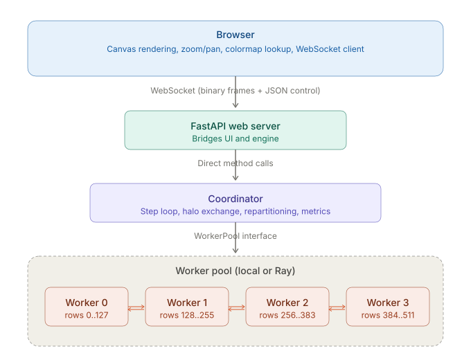
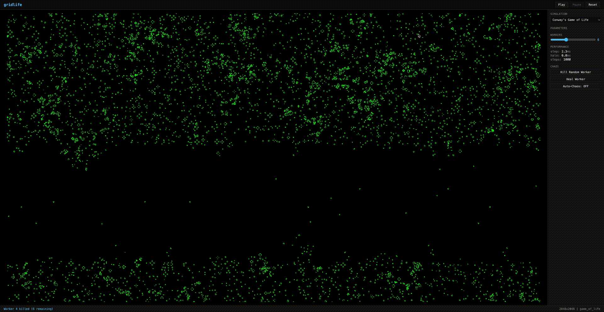
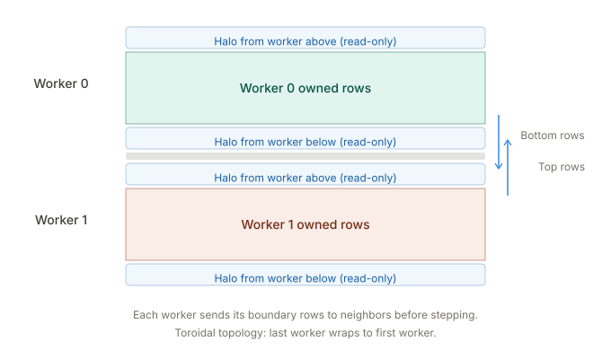

# gridlife

Distributed grid simulation engine. Runs 2D cellular automata and reaction-diffusion systems across multiple workers with live web visualization, domain decomposition, halo exchange, and fault tolerance.

Built on PyTorch for tensor computation, with optional Ray for cluster distribution.



## Simulations

Four built-in simulations, each a plugin that defines an update rule:

- **Conway's Game of Life** - binary cellular automaton with conv2d neighbor counting
- **Gray-Scott** - two-channel reaction-diffusion with 5 parameter presets (mitosis, coral, spirals, worms, holes)
- **Lenia** - continuous cellular automaton with ring-shaped convolution kernel (halo=13)
- **SmoothLife** - continuous Game of Life with sigmoid transition functions

Custom simulations: subclass `Simulation`, define `step()` and `init_grid()`, pass the file path to `--sim`.

## Setup

Requires Python 3.12+ and [uv](https://docs.astral.sh/uv/).

```bash
git clone https://github.com/rkv0id/gridlife.git
cd gridlife
uv sync
```

## Usage

### Web UI (interactive)

```bash
gridlife serve
gridlife serve --sim lenia --width 512 --height 512 --workers 4
gridlife serve --sim gray_scott --width 256 --height 256 --steps-per-run 2000
```

Open `http://localhost:8420`. Click Play. Scroll to zoom (centered on cursor), shift-drag to pan, click to perturb, right-click to erase.
<p align="center">
  <a href="https://www.youtube.com/watch?v=J_IESjgEVpw">
    
  </a>
</p>

<p align="center">
  <small><i>Click the GIF to watch the full simulation video</i></small>
</p>

### Headless (produce output)

```bash
gridlife run --sim gray_scott --steps 1000 --preset mitosis --output mitosis.png
gridlife run --sim lenia --width 512 --height 512 --steps 500 --output lenia.gif --fps 15
gridlife run --sim game_of_life --width 1024 --height 1024 --steps 5000 --workers 8
```

### List simulations

```bash
gridlife list
```

## How it works

The grid is split into horizontal strips, one per worker. Each worker owns its strip and computes the simulation step function independently. At strip boundaries, workers exchange halo (ghost) rows so the stencil computation at the edges has valid neighbor data.



The Coordinator orchestrates the step cycle: exchange halos, then step all workers in parallel. For rendering, each worker quantizes its strip to uint8 and the browser applies the colormap client-side.

### Local mode (default)

Workers are plain Python objects in the same process. Halo exchange is direct tensor slice copies - zero serialization, zero IPC. Fast enough for interactive use on a laptop.

### Cluster mode

```bash
gridlife serve --ray-address ray://cluster:10001 --workers 8
```

Workers become Ray actors distributed across the cluster. The web server runs on your machine, compute runs on the cluster.

### Fault tolerance

Kill a worker mid-simulation - the engine redistributes the surviving workers' data and continues. The dead worker's strip is zero-filled, creating a visible "scar" that heals as the simulation evolves. Chaos mode automates this: randomly kills and heals workers on a timer.

## Development

```bash
just check          # format, lint, typecheck, test
just serve          # start web UI
just run --sim lenia --steps 200 --output frame.png
just test-ray       # Ray integration tests (separate)
```

### Project structure

```
gridlife/
  engine/
    coordinator.py    Orchestrates workers via WorkerPool interface
    pool.py           LocalWorkerPool (in-process) and WorkerPool base
    ray_pool.py       RayWorkerPool (distributed via Ray actors)
    worker.py         StripWorker Ray actor
    partition.py      Grid splitting and merging
  simulations/
    base.py           Simulation base class and Param dataclass
    game_of_life.py   Conway's Game of Life
    gray_scott.py     Gray-Scott reaction-diffusion
    lenia.py          Lenia continuous CA
    smoothlife.py     SmoothLife continuous GoL
  web/
    server.py         FastAPI app, WebSocket handler, SimulationServer
    static/           Browser client (HTML, JS, CSS)
  viz/
    encoder.py        Binary frame protocol encoding
  cli.py              CLI entry point (serve, run, list)
```

### Key design decisions

- **WorkerPool abstraction**: Coordinator doesn't know if workers are local objects or Ray actors. Swap backends without changing orchestration logic.
- **Halo exchange before step**: Workers start with zero-initialized halos. Exchange must happen before the first step, not after.
- **Binary WebSocket protocol**: Server sends raw uint8 grid values (1 byte/cell). Browser does colormap lookup and renders to canvas. No JPEG encoding, no compression artifacts.
- **Client-side rendering**: Zoom, pan, and interpolation are all browser-side. Server sends data at grid resolution, browser scales it.
- **Bounded step loops**: Default 1000 steps per Play cycle. Prevents runaway CPU usage on laptops.

### Tests

```bash
just check                    # all tests (excludes Ray)
just test-ray                 # Ray integration tests
just test -v tests/test_pool.py   # specific test file
```

The most important test: multi-worker consistency. Same simulation with 1 worker vs N workers must produce identical results. If this passes, halo exchange is correct.
